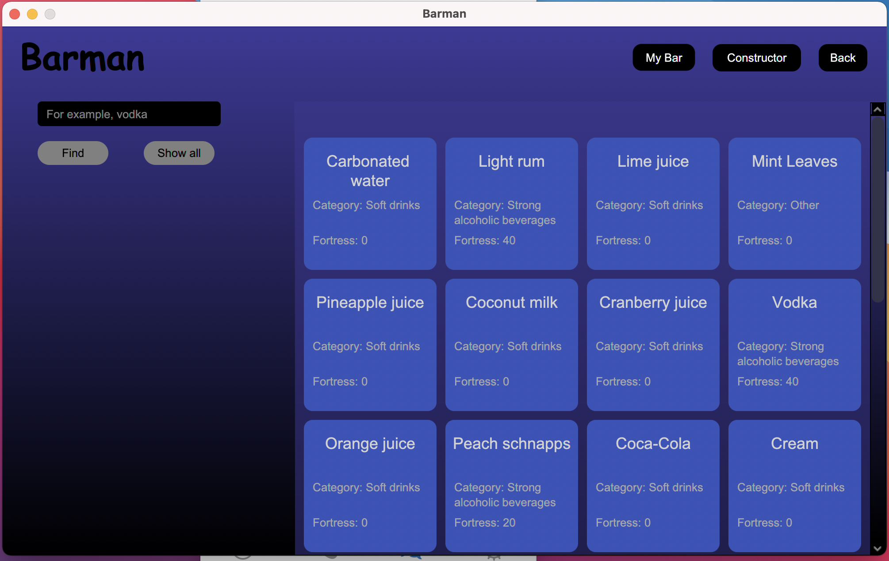

# Barman

***Save and diversify your party with the help of your personal barman.***

*[Technical specification](/docs/Specification-barman.md)*

### Screenshots

Actions can be performed either by *pressing buttons* or by pressing *the keyboard*.

When selecting the input field and the presence of the next field, the transition can also be done using the keyboard.
> Login page

When you select a square field, the password becomes *visible*.

> Join page

The password must contain more than *8 characters*, which are ***not*** *just numbers*.

> Main page

When you click on a cocktail in this and subsequent windows, the cocktail's personal page opens.

The account button is made gray to focus on other functionality.

Greeting phrases are randomly selected from the txt file.

> My Bar page

Your favorite cocktails are displayed here.

> Ingredients page

The search is possible by *name*, *fortress* and *category*.

To output, it is also possible to *press Enter* on the keyboard.

> Cocktails page

> Example of opening a cocktail

> Change password page

The new password passes *the same verification* as during registration.

> Change username page

